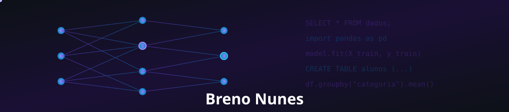

<div align="center">



<sub>🎓 Estudante de Ciência de Dados @ UEPB (Patos-PB) • Bolsista FAPESQ</sub>

<br/>

[](https://git.io/typing-svg)

<br/>


</div>

<br/>

## 📌 Sobre mim

Sou estudante do curso Tecnólogo em Ciência de Dados na Universidade Estadual da Paraíba (UEPB – Câmpus VII, Patos), atualmente no segundo período. Sou bolsista de Iniciação Científica pela FAPESQ, o que me permite unir a rotina acadêmica com experiência prática em projetos de pesquisa.

Estou construindo minha base em **Python**, **SQL**, **Estruturas de Dados** e **Orientação a Objetos**, com o objetivo de me especializar em pipelines de dados e soluções analíticas que transformem dados brutos em decisões melhores. Gosto de aprender na prática: cada projeto aqui no GitHub é parte desse processo de evolução constante.

> 🚀 Em constante aprendizado, sempre em busca do próximo desafio em dados.

<br/>

## 🗂️ Formação & Foco Atual

```yaml
Curso:      Tecnólogo em Ciência de Dados — UEPB (Câmpus VII, Patos-PB)
Período:    2º semestre
Bolsa:      Iniciação Científica / Projetos — FAPESQ
Foco atual: Python • SQL • Estruturas de Dados • Orientação a Objetos
Objetivo:   Construir pipelines de dados eficientes e soluções analíticas
```

<br/>

## 🛠️ Stack & Ferramentas

<div align="center">


</div>

<br/>

## 📊 Estatísticas do GitHub

<div align="center">


<br/>


</div>

<br/>

## 🐍 Atividade

<div align="center">


</div>

<br/>

## 📫 Contato

<div align="center">

<a href="#"></a>
<a href="mailto:brenonunesam@gmail.com"></a>
<a href="https://github.com/BrenoAmorim7"></a>

</div>

<br/>


</div>
